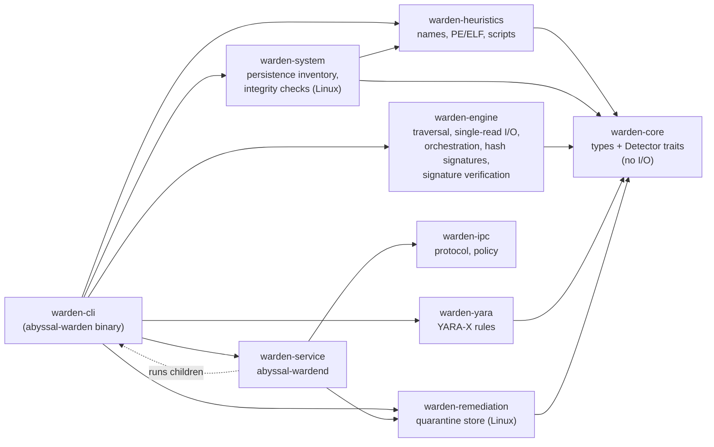

# Architecture

This is a map of the Abyssal Warden codebase: what lives where, how data
moves through it, and the rules the code relies on. It is meant to be read
before your first change. Design detail and the reasons behind decisions are
in [`docs/architecture/`](docs/architecture/overview.md) and the
[decision records](docs/architecture/decisions/README.md) (ADRs); this file
links to them rather than repeating them.

## Bird's-eye view

Abyssal Warden is an on-demand malware scanner with optional quarantine. A
scan takes a set of paths, reads every regular file under them **once**, and
passes what it learned to a list of **detectors** (exact-hash signatures,
YARA rules). The result is a structured, versioned **report**. If asked, the
CLI then hands findings that meet a strict policy to the **remediation**
subsystem, which quarantines files crash-safely.

The four library crates depend only on `warden-core`, never on each other.
The CLI is the only place they are put together. The future service and GUI
will be other places that compose them in the same way. See
[crate-boundaries.md](docs/architecture/crate-boundaries.md) for why each
boundary exists.

## Code map

### `crates/core`: `warden-core`

The vocabulary every other crate speaks. **No I/O, no threads, no platform
code.**

| File | What it holds |
|---|---|
| `config.rs` | `ScanConfig`, `ScanLimits` (size, depth, content size, per-file timeout, recording caps), `SymlinkPolicy` |
| `detector.rs` | `Detector` and `DetectorWorker` traits, `FileObservation` (path, hash, metadata, optional content, deadline), `DetectorRequirements`, `DetectorInfo`/`DatabaseInfo` |
| `finding.rs` | `Finding` and its enums: kind, severity, confidence, category, recommended action, remediation status |
| `report.rs` | `ScanReport` (the JSON contract, `REPORT_SCHEMA_VERSION`), stats, skips, issues |
| `path.rs` | `ObservedPath`: a path that always serialises, including non-Unicode names (`raw_hex`) |
| `digest.rs` | `Sha256Digest` with strict hex parsing |
| `text.rs` | Detecting and escaping control and bidi characters in untrusted text |
| `cancel.rs` | `CancellationToken` |

### `crates/engine`: `warden-engine`

Everything needed to scan, except content-specific detectors.

| File | What it holds |
|---|---|
| `scanner.rs` | `Scanner::scan`: walker thread, bounded work queue, worker threads, and the caller's thread as coordinator (aggregation, whole-scan time limit, stall watchdog that abandons stuck workers); panic isolation, per-file deadline, report assembly. The threading diagram is at the top of the file |
| `fsio.rs` | The hardened single read: symlink-free open (`openat2` on Linux; root-relative `cap-std` open elsewhere, so nothing resolves outside a scan root), non-blocking, `O_NOATIME` where permitted, type and size re-checked from the handle, duplicate-file check, SHA-256, optional content buffer, deadline and cancellation per 64 KiB chunk |
| `archive.rs` | ZIP expansion in memory: members, nesting, bomb budget, per-member reporting |
| `signatures.rs` | Hash database format v1 (strict parse and validation) and `HashSignatureDetector` |
| `trust.rs` | minisign verification (`TrustedKeys`), keyrings with revocation and validity windows, per-file `load_content` |
| `bundle.rs` | Signed content bundles: manifest format, verification, hash-checked root-relative file loading |
| `content_state.rs` | Rollback/equivocation state for bundles (locked, atomic) |

### `crates/yara`: `warden-yara`

`YaraDetector`: compiles rules with includes disabled and slow patterns
rejected, validates `aw_*` metadata, and keeps one YARA-X scanner per worker
thread. `examples/scanner_cost.rs` is the benchmark behind that choice.
Details: [docs/detection/yara.md](docs/detection/yara.md).

### `crates/remediation`: `warden-remediation`

The **only** code allowed to move or delete files.

| File | What it holds |
|---|---|
| `linux.rs` | `QuarantineStore`: open/lock/verify the store, quarantine, restore, delete, journal recovery. The step-by-step sequence is at the top of the file |
| `linux/tests.rs` | Store tests, including a simulated crash at each journal step |
| `record.rs` | `QuarantineRecord` (also the journal entry), `QuarantineId`, `ItemState` |
| `audit.rs` | Hash-chained JSON Lines audit log and its verifier |
| `allowlist.rs` | Allow-list of restored contents (exact SHA-256) |
| `linux/anchor.rs` | Sends each audit entry's hash to syslog/journald |
| `linux/processes.rs` | Finds processes mapping a file; pause/kill/resume guard |
| `policy.rs` | Which findings may be quarantined automatically; protected system paths |
| `lib.rs` | Public API, errors, and the `Unsupported` stub used on non-Linux platforms |

### `crates/heuristics`: `warden-heuristics`

The `heuristics` detector (`--heuristics`): file names, PE and ELF
structure (parsed read-only with `object`), scripts and locations. Also
owns the command-pattern table used by `warden-system`. Details:
[docs/detection/heuristics.md](docs/detection/heuristics.md),
[ADR-0017](docs/architecture/decisions/0017-file-heuristics.md).

| File | What it holds |
|---|---|
| `lib.rs` | `HeuristicsDetector`, `analyze`, format detection, entropy |
| `rules.rs` | The `AW-HEU-*` catalogue |
| `patterns.rs` | Shared command patterns |
| `names.rs`, `script.rs` | Name and script rules |
| `pe.rs`, `elf.rs` | Structural analysis |
| `examples/corpus_eval.rs` | Clean-corpus hit-rate measurement |

### `crates/system`: `warden-system`

Read-only persistence inventory and integrity checks for Linux and Windows
(`system-check`). Depends only on `warden-core`; the CLI adds content
scanning of referenced programs. Details:
[docs/detection/system-checks.md](docs/detection/system-checks.md),
[ADR-0015](docs/architecture/decisions/0015-system-checks.md).

| File | What it holds |
|---|---|
| `lib.rs` | `run_checks`, options, outcome, `host_path`, `correlate` |
| `fsx.rs` | Root-confined, bounded reads (`openat2(RESOLVE_IN_ROOT)`) |
| `ctx.rs` | Shared state; applies the rules to each persistence entry |
| `rules.rs` | The `AW-SYS-*` rule catalogue |
| `heuristics.rs` | Command patterns, executable extraction, temp/hidden paths |
| `persistence/` | One module per mechanism (systemd, cron, files, ssh, pam, udev) |
| `kernel.rs`, `processes.rs` | Module cross-view, taint, hidden PIDs, deleted executables |
| `packages.rs` | Package verification: native dpkg database reader, rpm digest query; files hashed here |
| `boot.rs`, `ebpf.rs` | Boot integrity; eBPF program inventory |
| `tool.rs` | Runs external tools (rpm, bpftool) with a clean environment, timeout and bounded output |
| `winrules.rs` | Windows rules and parsers (task XML, image paths), tested on every platform |
| `windows.rs` | Live Windows registry and file reading |
| `users.rs` | `/etc/passwd` parsing |

### `crates/ipc`: `warden-ipc`

The service protocol: `Request`/`Response`, framing with size limits,
`Request::validate`, and the authorisation matrix (`policy`). Pure and
platform-neutral.

### `crates/service`: `warden-service`

The Linux daemon library behind `abyssal-wardend`
([ADR-0018](docs/architecture/decisions/0018-service-and-ipc.md)).

| File | What it holds |
|---|---|
| `lib.rs` | `run`: configuration, checks, threads, shutdown |
| `server.rs` | Socket, `SO_PEERCRED`, dispatch |
| `jobs.rs` | Queue, workers, result processing, remediation |
| `runner.rs` | Children via `setpriv`: identity, capabilities, deadline, process group |
| `schedule.rs`, `audit.rs` | Schedules; audit-chain comparison with the journal |
| `store.rs`, `config.rs`, `accounts.rs` | History, configuration, users and groups |
| `client.rs` | The client used by `abyssal-warden service` |

### `crates/cli`: `warden-cli` (binaries `abyssal-warden`, `abyssal-wardend`)

| File | What it holds |
|---|---|
| `main.rs` | Argument parsing, the `scan`/`hash`/`validate` commands, progress line, exit codes, Ctrl-C handling, atomic report writing |
| `content.rs` | Loading content: keyrings, bundles (with rollback state), individually signed files; verify, then parse |
| `content_cmd.rs` | `content manifest` / `content verify` |
| `paths.rs` | Default state locations |
| `output.rs` | Human-readable report; every untrusted string is escaped here |
| `quarantine.rs` | `quarantine` subcommands and `scan --quarantine` |

### Everything else

| Path | What it holds |
|---|---|
| `crates/*/tests/` | Integration and black-box tests (see [testing](docs/development/testing.md)) |
| `fuzz/` | cargo-fuzz targets: `signature-db`, `digest-parse`, `yara-scan`, `audit-log`, `archive-expand`, `system-parsers`, `heuristics`, `ipc-decode`. Separate workspace, nightly |
| `examples/` | Synthetic test content, signed with a throwaway **test** key |
| `docs/` | Architecture, security, detection, platform, development and user docs ([index](docs/README.md)) |
| `deny.toml`, `.cargo/audit.toml` | Dependency policy and accepted advisories |
| `.github/workflows/ci.yml` | Required CI gates |

## How a scan flows

1. **Load content** (`cli/content.rs`). Bundles: the manifest signature is
   verified against the keyrings, expiry and rollback are checked, and each
   file is hash-checked before parsing (`engine/bundle.rs`). Individually
   signed files: each `.minisig` is checked. Any failure stops the program
   before scanning.
2. **Configure** (`core/config.rs`). `Scanner::new` validates the config.
3. **Walk** (`engine/scanner.rs`). One walker thread resolves roots,
   applies excludes, the symlink policy and depth limit, and puts regular
   files on a bounded queue. Meanwhile the calling thread coordinates:
   whole-scan time limit, cancellation, and a watchdog that abandons and
   replaces a worker stuck on one file.
4. **Read once** (`engine/fsio.rs`). A worker opens each file safely,
   hashes it, and keeps the bytes if a detector needs content and the file is
   within `max_content_size`.
5. **Detect**. Each detector's per-worker state (`Detector::worker`) gets the
   `FileObservation`, inside `catch_unwind`, with the deadline checked
   before each detector. If the file is a ZIP, its members are decompressed
   in memory (`engine/archive.rs`) and each goes through the same
   detectors, with its member chain recorded.
6. **Aggregate**. The caller's thread counts results, applies recording caps,
   calls the progress callback, and builds a sorted `ScanReport`.
7. **Remediate** (only with `--quarantine`; `cli/quarantine.rs`). Findings
   that pass `policy::auto_quarantine_target` go to `QuarantineStore`; each
   finding records the outcome.
8. **Render** (`cli/output.rs`) as JSON or escaped text, and set the exit
   code.

## Architecture invariants

These rules hold across the codebase. A change that breaks one needs an ADR,
not just a code review.

* **`warden-core` has no I/O.** It is types and traits only.
* **Detection never modifies the host.** The engine and detectors only read.
  Moving or deleting files happens only in `warden-remediation`, and only when
  the user asks for it.
* **Detectors never open files.** The scanner does the one hardened read and
  hands out the bytes, so the symlink, FIFO and size protections live in one
  place (`fsio.rs`).
* **Nothing unverified is parsed.** Detection content is signature-checked
  before parsing, unless `--allow-unsigned` is given. A bad signature is
  always fatal.
* **Untrusted text is escaped before display.** File names, rule names and
  metadata can contain terminal escape sequences or bidi overrides; use
  `warden_core::text` / `output::sanitize`.
* **Everything is bounded.** Every loop over untrusted input has a limit,
  every channel is bounded, every file has a size and time budget. The
  default limits are in `ScanLimits`.
* **Failures are data, not aborts.** A file that can't be read, or a detector
  that errors, panics or hangs, becomes a `ScanIssue`; the scan continues.
  A report always distinguishes "nothing found" from "not checked".
* **Every scan finishes, and every file is accounted for.** No file can hang
  a scan (watchdog), and queued work that was never scanned is reported, never
  counted as completed ([ADR-0009](docs/architecture/decisions/0009-stall-watchdog.md)).
* **No `unsafe`, except `warden-winsec`** (Windows FFI, ADR-0019). `unsafe_code = "forbid"` applies everywhere else.
  Release builds keep `panic = "unwind"` so detector panics can be isolated.
* **The JSON report is the compatibility contract**, versioned by
  `REPORT_SCHEMA_VERSION`. The Rust API is internal until 1.0.
* **Automatic remediation is narrow.** Only confirmed exact-hash malware
  matches outside system directories, with the hash re-checked at
  quarantine time.

## Trust boundaries

| Boundary | Untrusted side | Where it is enforced |
|---|---|---|
| Filesystem to engine | File contents, names, directory structure | `engine/fsio.rs`, `engine/scanner.rs`, `core/path.rs` |
| Content files to detectors | Databases, YARA rules | `engine/trust.rs`, `engine/signatures.rs`, `yara/src/lib.rs` |
| File content to parsers | Bytes given to YARA-X modules | YARA-X; limits in `yara/src/lib.rs`; `yara-scan` fuzz target |
| Report to terminal | Anything that came from disk or rules | `cli/output.rs`, `core/text.rs` |
| Remediation to filesystem | Paths, concurrent changes by other processes | `remediation/src/linux.rs` |

Full analysis: [threat model](docs/security/threat-model.md).

## Common changes

* **Add a detector:** implement `warden_core::Detector` in a new crate if it
  brings heavy dependencies, or in the engine if it doesn't. Declare
  `requirements()` if it needs content, override `worker()` if it needs
  per-thread state, honour `FileObservation::deadline`, and add it in
  `cli/src/main.rs::load_detectors`. Add a fuzz target if it parses anything.
* **Add a report field:** make it optional (`serde(default)`); consumers must
  keep working. Removing or renaming a field means bumping
  `REPORT_SCHEMA_VERSION`.
* **Add a CLI flag:** `ScanArgs` in `cli/src/main.rs`, and document it in
  [docs/user/scanning.md](docs/user/scanning.md).
* **Touch file opening, parsing, signatures or remediation:** these are
  security-sensitive. Follow the
  [security review](docs/development/contributing.md#security-review) steps
  and update the threat model.

## Platform differences

| Area | Linux | Windows |
|---|---|---|
| Scanning, hashing, signatures, YARA | Supported and tested | Builds; tests run in CI |
| No-follow open | `O_NOFOLLOW`, `O_NONBLOCK` | `FILE_FLAG_OPEN_REPARSE_POINT` |
| Quarantine | Supported (Linux 5.6+, `openat2`) | Returns `Unsupported` |

Platform code is `cfg`-gated inside the crate that needs it; `warden-core`
has none. See [docs/platform/](docs/platform/linux.md).

## Not built yet

The background service, authenticated IPC, GUI, real-time protection,
Windows persistence checks, persistence cleanup and an update mechanism are
designed or researched but not implemented. See [ROADMAP.md](ROADMAP.md) and
[known limitations](docs/known-limitations.md).
