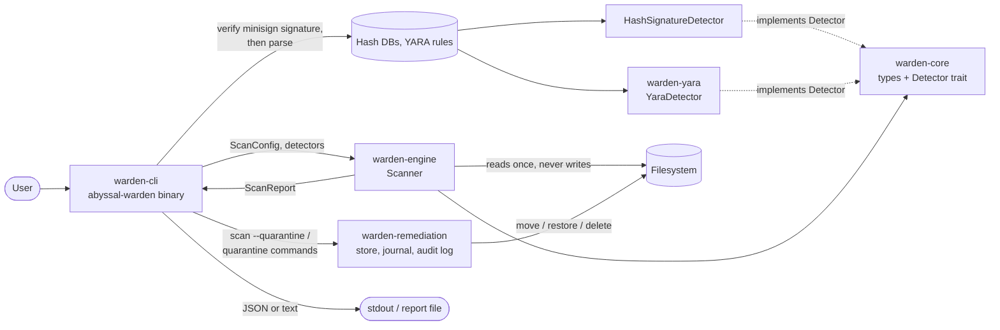
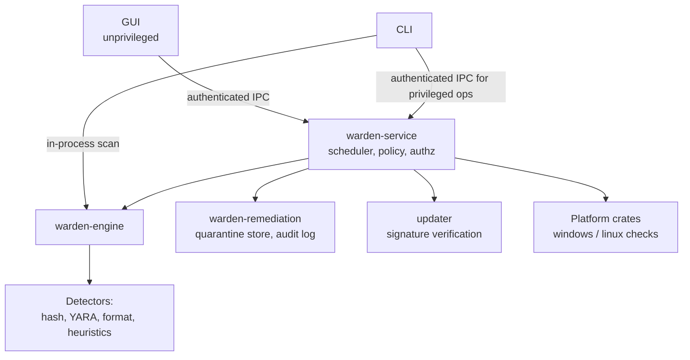

# Architecture overview

## Purpose

Abyssal Warden is structured as a set of independent components around a
GUI-free core, so that detection can be used from a CLI, a background service,
a GUI or tests without change, and so that security-sensitive operations can
be isolated in their own processes.

## Current system

| Component | Responsibility | Status |
|---|---|---|
| `warden-core` | Data model (config, findings, reports), `Detector`/`DetectorWorker` traits, cancellation, display-text safety | implemented |
| `warden-engine` | Traversal, hardened single-read file access, hashing, content buffering, per-file deadlines, orchestration, hash-signature detector, signature verification (`trust`) | implemented |
| `warden-yara` | YARA-X rules: compile, validate metadata, scan content | implemented |
| `warden-remediation` | Quarantine, restore, delete, crash recovery, audit log | implemented (Linux only) |
| `warden-cli` | Arguments, content loading, progress, rendering, exit codes, quarantine commands | implemented |
| `warden-service`, `warden-ipc` | Scheduling, IPC, privileged operations | implemented (Linux; [ADR-0018](decisions/0018-service-and-ipc.md)) |
| `warden-system` | Persistence inventory, rootkit and integrity checks | implemented (Linux only) |
| GUI | Desktop front end | [evaluated](gui.md), not implemented |

## Data flow of a scan

1. The CLI loads each hash database and YARA rule file, verifies its minisign
   signature against the trusted keys, and only then parses and validates
   it. Any failure aborts before scanning (never scan with a silently
   reduced detector set).
2. The CLI builds a `ScanConfig`; `Scanner::new` validates it.
3. `Scanner::scan` resolves roots (canonicalises, de-duplicates nested roots)
   and excludes, then starts one walker thread and N worker threads. The
   calling thread becomes the coordinator: it enforces the whole-scan time
   limit and runs the stall watchdog
   ([ADR-0009](decisions/0009-stall-watchdog.md)).
4. The walker enumerates entries with `walkdir`, applying excludes, the
   symlink policy, the depth limit and the same-filesystem option. Regular
   files go to a **bounded** work queue; directories, skips and walk errors go
   to a **bounded** result channel.
5. Each worker creates its per-thread detector state once
   (`Detector::worker`; e.g. one YARA-X scanner). For each file it opens it
   with the hardened routine in `fsio.rs`, re-checks type and size from the
   handle, and reads it once: it hashes the bytes and, if a detector needs
   content and the file is within `max_content_size`, keeps them in a reused
   buffer. Cancellation and the per-file deadline are checked per 64 KiB
   chunk. Every detector is then called inside `catch_unwind`, with the
   deadline checked before each one.
6. The calling thread aggregates results, enforces recording limits, and
   invokes the progress callback. It sorts the results for deterministic
   output and returns a `ScanReport`.
7. With `--quarantine`, the CLI passes each finding that meets the
   automatic policy to `warden-remediation` and records the outcome on the
   finding.
8. The CLI renders the report (sanitising all untrusted strings) and derives
   the exit code.

The threading and channel design is documented at the top of
`crates/engine/src/scanner.rs`.

## Target architecture

The main principles:

* The engine never modifies the filesystem. Remediation is a separate crate
  (`warden-remediation`). Today the CLI calls it with the user's privileges;
  once the service exists, privileged remediation will run only there,
  after an authorisation decision.
* Unprivileged front ends (GUI, CLI) request privileged operations; they
  never perform them. See the [privilege model](../security/privilege-model.md).
* Platform-specific code lives in platform crates or `cfg`-gated modules and
  reports "unsupported" rather than silently doing nothing.

## Error model

| Level | Representation | Effect |
|---|---|---|
| Invalid configuration, thread spawn failure | `ScanError` (Rust error) | Scan does not run / aborts |
| Unreadable file or directory, walk loop, I/O error | `ScanIssue` in the report | Scan continues; coverage marked incomplete |
| Detector error or panic | `ScanIssue` with `kind = detector_failed` | Other detectors still run on the file |
| Policy skip (size, symlink, FIFO, exclude, depth) | `SkippedEntry` + counters | Expected; does not make the scan incomplete |
| Invalid signature database | `SignatureDbError` | CLI refuses to scan |

Production code uses no `unwrap`/`expect` (enforced by Clippy lints), and
`unsafe` is forbidden workspace-wide except in `warden-winsec` ([ADR-0019](decisions/0019-windows-unsafe-boundary.md)).

## Extension points

* **New detectors** implement `warden_core::Detector` and are added with
  `Scanner::add_detector`. Orchestration does not change. See the
  [detection pipeline](detection-pipeline.md).
* **New finding targets** (processes, registry keys, services) are added as
  `FindingTarget` variants. The enum is `#[non_exhaustive]`.
* **Service/GUI integration**: `Scanner::scan` takes a `CancellationToken`
  and a progress callback, and returns a serialisable `ScanReport`, which is
  the unit the service will persist and send over IPC.
