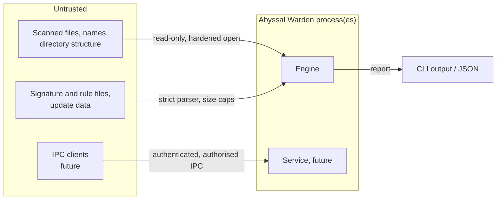

# Threat model

Abyssal Warden processes attacker-controlled input by design, and will
eventually hold privileges. Its own attack surface is a primary concern.
This document distinguishes what the **current implementation addresses**
from what depends on **future components**. Review and update it with every security-sensitive
change (see [contributing](../development/contributing.md#security-review)).

## Assets

| Asset | Why it matters |
|---|---|
| Integrity of the host | A scanner that can be turned into an exploit primitive (code execution, arbitrary file write or delete) is worse than no scanner |
| Accuracy of results | False negatives hide compromise; false positives drive destructive "remediation" |
| Detection content | Poisoned rules or hashes cause misses or mass false positives |
| Quarantined samples | Live malware; must not be executed, leaked or restored unsafely |
| Evidence and audit logs | Needed for incident response; must be tamper-evident |
| Availability | A scanner that hangs or exhausts resources can be used as a denial of service |

## Trust boundaries

The **user running the CLI** is trusted to choose what to scan and which
databases to load. Everything they point it at is untrusted.

## Threats

Status key: **mitigated** (implemented and tested), **partial**,
**future** (needs a component that does not exist yet), **accepted** (known
residual risk).

### T1: Malicious files exploiting parsers

* **Threat:** crafted content triggers memory corruption or logic bugs in
  file parsers.
* **Current:** partial. Our own code is safe Rust (`unsafe_code = "forbid"`).
  File content is parsed only by YARA-X's modules (PE, ELF, Mach-O, .NET,
  LNK, DEX), which are Rust. Only the modules we list are compiled in.
  Detector panics are isolated per call and the per-worker state is rebuilt
  afterwards. The `yara-scan` fuzz target drives all enabled format modules
  with arbitrary bytes (initial campaign: ~104k inputs over 7 minutes, no crashes).
* **Residual:** YARA-X and wasmtime are large dependencies whose own
  `unsafe` code we do not audit. A parser bug runs in the scanning process
  with the user's privileges.
* **Current (service, Linux):** service jobs parse content in a separate
  process running as the unprivileged scanner account with only
  `CAP_DAC_READ_SEARCH` (or as the requesting user), with `no_new_privs`;
  a parser bug there cannot write to the system or the quarantine store.
* **Future:** seccomp/landlock inside that process; AppContainer on Windows;
  the same separation for direct CLI scans.

### T2: Archives and decompression bombs

* **Current:** mitigated for ZIP ([archives.md](../detection/archives.md),
  [ADR-0011](../architecture/decisions/0011-archive-scanning.md)).
  * Members are decompressed in memory only; names are never used as paths,
    so zip-slip does not apply.
  * Bomb and exhaustion limits: total decompressed bytes per file (1 GiB),
    nesting depth (3), entries per archive (10,000), member bytes kept (8 MiB),
    per-file deadline, checked every 64 KiB of output.
  * The parser runs inside `catch_unwind`, under the stall watchdog, and is
    fuzzed.
  * Everything not inspected is reported.
* **Residual:** other archive formats are not expanded (a detection gap,
  not a safety risk).

### T3: Path traversal

* **Current:** mitigated. The engine only reads paths produced by directory
  enumeration under canonicalised roots; it never builds paths from file
  contents. Excludes use component-wise matching (`/skip` does not exclude
  `/skipnot`; this is tested).
* **Future:** quarantine restore and archive extraction must validate target
  paths ([quarantine.md](quarantine.md)).

### T4: Symlink and reparse-point attacks

* **Threat:** a link inside a scanned tree points at `/etc/shadow` or a
  device, leaks content, or causes loops. A file is swapped for a link
  between enumeration and open (TOCTOU).
* **Current:** mitigated.
  * Default policy `skip`: links are not followed and are reported as
    skipped.
  * On Linux, files are opened with `openat2(RESOLVE_NO_SYMLINKS)`: no link
    is followed in *any* path component, so a file or directory swapped for a
    link after enumeration is refused (tested). Kernels before 5.6 fall back
    to `O_NOFOLLOW`. On Windows, `FILE_FLAG_OPEN_REPARSE_POINT` protects the
    final component.
  * `follow` policy uses walkdir's loop detection; loops become issues (tested).
    The report warns that followed links may leave the scan roots.
  * Under `follow`, a file reachable through several links is scanned once
    (de-duplicated by device and inode on Unix, volume serial number and file
    index on Windows).
  * On Windows, other platforms, and Linux < 5.6, files are opened relative
    to a handle on their scan root (`cap-std`), so resolution can never leave
    the root even if directories are swapped mid-scan
    ([ADR-0010](../architecture/decisions/0010-root-relative-opens.md)).
  * **Residual:** on those platforms a link that stays inside the root can
    redirect a read to another in-root file (in scope anyway).

### T5: FIFOs, devices and special files

* **Threat:** opening a FIFO blocks forever; reading `/dev/zero` never ends;
  reading a tty has side effects.
* **Current:** mitigated. Non-regular entries are skipped. Opens use
  `O_NONBLOCK | O_NOCTTY`, and the type is re-checked with `fstat` on the
  handle. `/proc` and `/sys` are excluded by default on Linux. FIFO handling
  is tested.

### T6: Malicious rule and signature files

* **Current:** mitigated for the hash database. 256 MiB cap, strict schema,
  validation of every field, rejection of control and bidi characters,
  duplicate detection, all-or-nothing loading. The parser is fuzzed
  (8.3M executions without a crash in the initial run). An invalid database
  aborts the scan instead of silently reducing coverage.
* **Current (YARA rules):** mitigated. `include` disabled (it would let a
  rule read arbitrary files), slow patterns and unknown/invalid `aw_*`
  metadata rejected, size and rule-count caps, strict regex syntax, scan
  timeouts and match caps, compiled-rule files not accepted.
* **Current (authenticity):** mitigated. Content must be signed by a trusted
  minisign key unless `--allow-unsigned` is given. Verification happens
  before parsing, and invalid signatures are always fatal. Reports record
  the signer and warn about unsigned content.
* **Current (bundles):** signed manifests pin every file; rollback,
  equivocation and expiry are enforced; keyrings bound key validity, set a
  signature threshold and per-bundle sequence floors; revocations travel
  with content and only ever remove trust
  ([content-trust.md](content-trust.md)).
* **Residual:** individually signed files have no rollback or expiry
  protection (the report warns), and a malicious *trusted* signer can still
  cause false positives. The damage is limited because automatic remediation only acts
  on confirmed malware hash matches, re-checks the hash, and never touches
  system directories.

### T7: Compromised update sources

* **Current:** partial. There is no update mechanism. Signed bundles give
  rollback, freeze and mix-and-match protection, and keyrings give
  revocation and rotation (T6).
* **Future:** an automatic updater (TUF: threshold signatures, role
  separation), never executing downloaded code
  ([update-security.md](update-security.md)).

### T8: Unauthorised GUI or CLI-to-service requests

* **Current (Linux):** mitigated. Unix socket only, no network listener.
  * The peer uid comes from the kernel (`SO_PEERCRED`).
  * Every request is validated (version, unknown operations and fields,
    absolute paths, sizes checked before allocation) and authorised against
    the matrix in [privilege-model.md](privilege-model.md).
  * Other users' jobs are reported as not found.
  * Scans for non-administrators run as the caller, so the service cannot
    be used to read files the caller could not read.
  * Connections are bounded (64, 1,000 requests each, 30-second timeouts)
    and the job queue is bounded. The decoder is fuzzed.
* **Residual:** any local user can queue scans up to the queue limit (a
  local denial of service on scanning; use `socket_group` to restrict who
  can connect). Windows transport pending (Phase 8).

### T9: Privilege escalation through the product

* **Current:** mitigated by design. The CLI runs with the invoking user's
  privileges and has no setuid, service or elevation path. Reports written
  with `--output` go via a temp file plus atomic rename (mode 0600 on Unix), so
  an existing symlink at the destination is replaced rather than written
  through.
* **Current (service):** the service is the only privileged component.
  * Its configuration and scanner binary must be root-owned and not
    writable by others, or it refuses to start.
  * Children are started through `setpriv` with a minimal environment and
    reduced identity. Paths are passed after `--`, so they can never be read
    as options.
  * Remediation happens only in the service, after the report is read.
  * The systemd unit adds a capability bounding set, `NoNewPrivileges` and a
    system-call filter.

### T10: Quarantine tampering and remediation attacks

* **Threats:** tricking remediation into deleting or moving the wrong file
  (symlink swaps, `..`, hard links, TOCTOU); reading or executing quarantined
  malware; restoring over an existing file or into an attacker-writable
  directory; corrupting state through crashes; forging quarantine IDs to
  reach other files.
* **Current (Linux):** mitigated, with each point tested:
  * `openat2(RESOLVE_NO_SYMLINKS)` on every path, handle-relative open and
    unlink, and removal only if the name still refers to the copied inode.
  * Hard-linked files are refused.
  * The expected hash is re-checked before anything changes.
  * The store is 0700, owned by the user, never opened through a link, and
    locked with `flock`.
  * Content is XOR-encoded with a random key, so it is inert.
  * Restore never overwrites (`RENAME_NOREPLACE`/`link`), refuses group- or
    world-writable directories, and strips setuid/setgid.
  * IDs are parsed strictly (no path syntax).
  * Journal-based crash recovery, tested by fault injection at every step.
* **Residual:** the inode-check-to-unlink race (limited to one name in a
  directory the attacker can already modify); no privilege separation yet;
  Windows has no quarantine. See [quarantine.md](quarantine.md#not-guaranteed).

### T11: Malicious configuration changes

* **Current:** partial. `ScanConfig` is validated and deserialises with
  `deny_unknown_fields`. Configuration comes only from CLI arguments today.
* **Current (service):** the service configuration must be root-owned and
  not group- or world-writable, rejects unknown fields and invalid values,
  and cannot be changed over IPC.
* **Future:** configuration changes over the authorised IPC, audit-logged.

### T12: Resource exhaustion

* **Current:** mitigated.
  * Bounded worker count (1-64, default ≤ 8).
  * Bounded work and result channels (memory is independent of tree size).
  * Per-file size limit, enforced from the handle **and** during reading,
    so a file growing mid-read is caught.
  * Depth limit.
  * Recorded findings, skips and issues are capped; the rest are only counted.
  * Streaming hash with a 64 KiB buffer.
  * Cancellation checked per file and per chunk.
  * Measured: ~46k files / 660 MiB scanned with 4 MB peak RSS.
  * Per-file time limit (default 60 s), checked between read chunks, before
    each detector, and inside YARA-X.
  * Content buffered for YARA only up to `max_content_size` (64 MiB), so
    worst-case buffer memory is bounded by `workers × 64 MiB`.
  * Watchdog: a worker stuck on one file (blocked read, or a detector ignoring
    its deadline) for more than the per-file limit + 2 s is abandoned and
    replaced, and the file is reported. The scan always finishes
    ([ADR-0009](../architecture/decisions/0009-stall-watchdog.md)).
  * Optional whole-scan time limit (`--scan-timeout`).
* **Partial:** an abandoned thread keeps its buffer and file descriptor until
  its blocked call returns (at most `workers` replacements per scan).

### T13: False positives and unsafe remediation

* **Current:** mitigated.
  * Remediation happens only when the user asks for it (`scan --quarantine`
    or `quarantine add`). The automatic policy accepts only confirmed
    exact-hash malware matches outside protected system directories; YARA,
    heuristic, suspicious and test findings are marked `not_eligible`.
  * Quarantine is always reversible until an explicit
    `quarantine delete --yes`.
  * YARA rules cannot claim `confirmed` confidence.

### T14: Compromised host visibility (rootkits)

* **Accepted:** a scanner running inside a compromised OS sees what the
  kernel shows it. Kernel rootkits can hide files and processes completely.
* **Current (Linux):** `system-check` cross-checks kernel modules
  (`/proc/modules` against `/sys/module`), sweeps every PID for processes
  missing from the `/proc` listing, reads taint flags, and verifies critical
  files with the package manager
  ([ADR-0015](../architecture/decisions/0015-system-checks.md)). These raise
  the cost for careless user-mode and kernel rootkits. The scanner also checks
  its own process for injected libraries (AW-SYS-019), which exposes
  user-mode rootkits even when they hide `/etc/ld.so.preload`, and it hashes
  package files itself rather than trusting `rpm`/`dpkg` to read them. They cannot defeat a
  determined kernel-level adversary, and every report says so.
* **Mitigation:** offline inspection from trusted media (`scan` and
  `system-check --root` on the unmounted disk). `--root` reads are confined
  to the image with `openat2(RESOLVE_IN_ROOT)`, so a hostile image's links
  cannot redirect reads to the host.
* **Residual:** the package database (and the host's `rpm` reading it) is
  trusted; configuration files are untrusted input (bounded, parsed without
  executing anything; output sanitised).

### T15: Tampering with logs or detection evidence

* **Current:** partial.
  * Scan reports are written atomically but are ordinary user-owned files.
    * Remediation actions go to a hash-chained audit log that detects edits,
    removals and reordering; the store refuses to open when the chain is
    broken.
  * Each entry's hash is anchored in the system log (syslog/journald), which
    unprivileged users cannot rewrite, so a forged but self-consistent local
    chain no longer matches its anchors.
  * The service compares the chain with the journal automatically (every
    `audit_check_hours`, and on request), using only anchors journald
    attributes to the service's uid and to this chain's identifier, and logs
    `AUDIT LOG CHECK FAILED` on a mismatch.
  * Residual: root can alter both the log and the journal.
* **Future:** remote log forwarding; Windows Event Log.

### T16: Output injection via hostile names

* **Threat:** a file named with ANSI/OSC escape sequences rewrites the
  terminal, spoofs output or sets the window title. Bidi overrides disguise
  `invoice‮fdp.exe`. Non-UTF-8 names break JSON generation.
* **Current:** mitigated. All untrusted strings are escaped before terminal
  output (C0/C1 controls, DEL, bidi controls). Paths serialise losslessly via
  `ObservedPath.raw_hex`. Tested end-to-end with a hostile file name.

## Assumptions

* The Rust toolchain, the standard library and audited dependencies are
  trustworthy (cargo-deny and RustSec checks in CI).
* The user who invokes the CLI is not the adversary.
* The OS kernel is not compromised. When it is, see T14.
